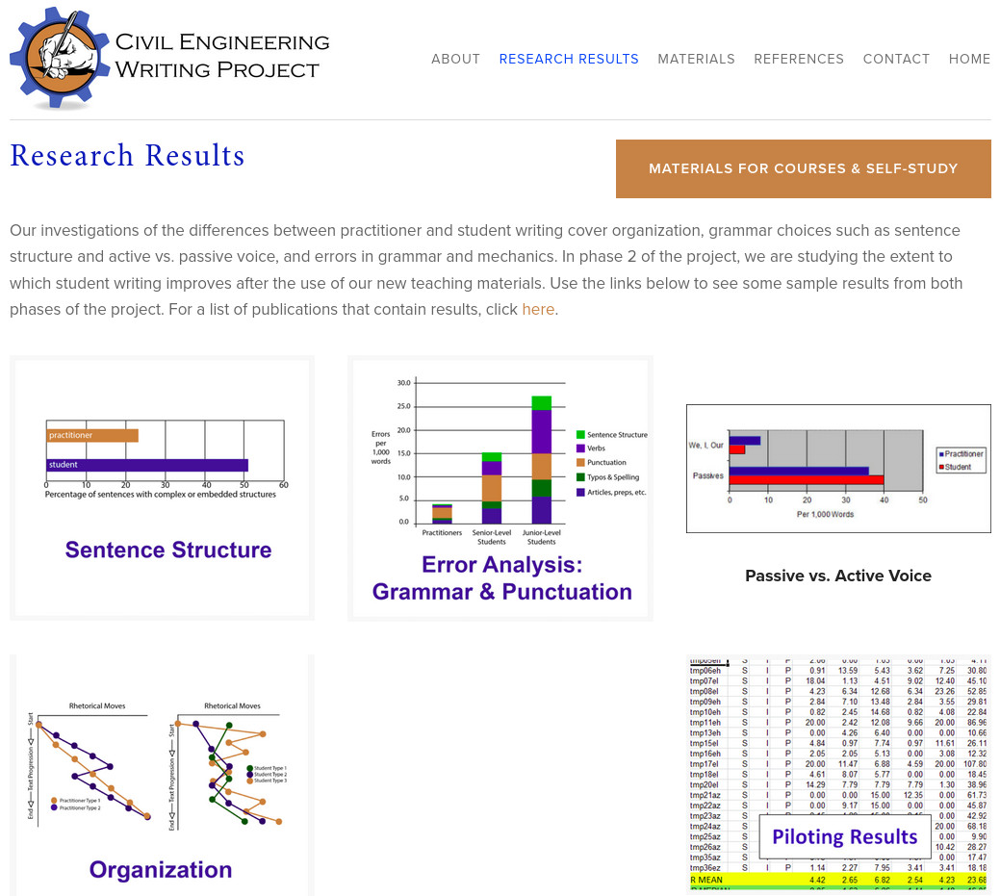
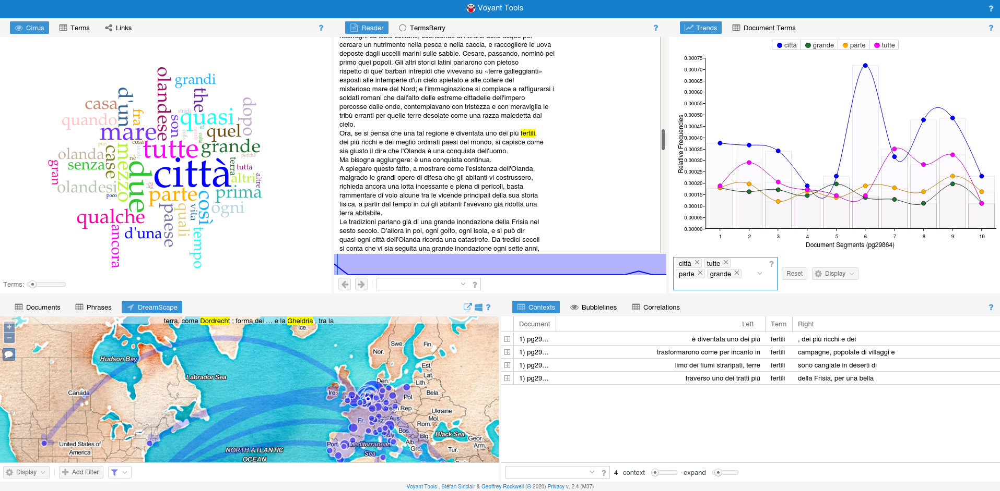

# Lingua italiana e didattica digitale: consigli, suggerimenti e buone pratiche

## Slide del webinar

<a href="https://docs.google.com/presentation/d/1pu8b3L7J1aJ5fAxT6sb9XZ1IBkbcTC8klgbXqq8l-CE" rel="FEM Future Education Modena" target="_blank">Link diretto alle slide</a>

<iframe src="https://docs.google.com/presentation/d/1pu8b3L7J1aJ5fAxT6sb9XZ1IBkbcTC8klgbXqq8l-CE/embed?start=false&loop=true&delayms=5000" frameborder="0" width="960" height="569" allowfullscreen="true" mozallowfullscreen="true" webkitallowfullscreen="true"></iframe>

## 1. Linguistica: che cos’è? Che cosa ci insegna? Come può essere utilizzata per favorire l’apprendimento? Una chiacchierata con i linguisti

### Introduzione

servono delle slides

## 2. Annotazione linguistica in classe: esercizi di comprensione del testo

Tra le nostre attività (disponibili <a href="https://www.fem.digital/scuola/" target="_blank">qui</a>), vi proponiamo un approccio inedito alla **comprensione del testo** per riflettere sull’**evidenzialità**, ovvero le modalità con cui le informazioni vengono riportate all’interno di un testo e che determinano l’attendibilità di una fonte, e le **metafore concettuali**, ovvero l’uso di espressioni linguistiche metaforiche per la rappresentazione di un dato argomento. 
Abbiamo scelto di portare in classe un’operazione fondamentale in linguistica computazionale, l’**annotazione del testo**, tramite *Doccano*, uno strumento open-source per la classificazione e l’annotazione di testi di qualunque tipo. 
Vediamo adesso gli step da seguire per utilizzarlo al meglio.

### Video-tutorial all’uso della piattaforma

Ora faremo una demo live delle attività

<iframe src="https://docs.google.com/presentation/d/1pu8b3L7J1aJ5fAxT6sb9XZ1IBkbcTC8klgbXqq8l-CE/embed?start=false&loop=true&delayms=5000" frameborder="0" width="960" height="569" allowfullscreen="true" mozallowfullscreen="true" webkitallowfullscreen="true"></iframe>

<iframe width="560" height="315" src="https://www.youtube.com/embed/tzLIxXLdHDI" frameborder="0" allow="accelerometer; autoplay; encrypted-media; gyroscope; picture-in-picture" allowfullscreen></iframe>

### Step 1: Accedere alla piattaforma
1. Collegarsi al sito seguendo <a href="http://doccano.fem.digital/" target="_blank">questo link</a>
2. Fare il **login**. Se si accede per la prima volta, si può 
    - Fare login col proprio account Google
    - Registrare un nuovo account

La piattaforma vi reindizzerà alla pagina *Projects*, contenente i dataset per le diverse attività.

### Step 2: Iniziare l’attività
Dopo aver selezionato il progetto **Comprensione del Testo | Climate Change** (nella pagina Projects) sarà possibile iniziare l’attività. 
Le componenti fondamentali sono
- Articoli
- Etichette

### Step 3: Svolgere l’attività su doccano
Si richiede di annotare la parte di testo che manifesta una delle caratteristiche espresse dalle etichette.  Si lavora su due livelli
- **Evidenzialità** (Opinione - Fonte assente - Fonte certa - Fonte incerta)
- **Metafore** (Dominio bersaglio - Dominio sorgente)

## 3. Esempi pratici e strumenti digitali per attività didattiche

In questa sezione vi parleremo di due *case studies* provenienti dal mondo dell’ingegneria civile e della medicina, in cui la linguistica è stata fondamentale per rispondere a problemi ed esigenze reali degli studenti. Infine vi presenteremo **Voyant Tools** con alcuni esempi di applicazione, sperando che possa essere d’ispirazione per le vostre attività future.

IMMAGINE
[Background vector created by macrovector - www.freepik.com](https://www.freepik.com/free-vector/engineer-cartoon-vertical-banners_4005768.htm#query=civil%20engineer&position=10)

### Linguistica per i linguaggi tecnici e specialistici: il caso dell’Ingegneria Civile

Il progetto <a href="http://www.cewriting.org/" target="_blank">Civil Engineering Writing Project</a> esemplifica bene l’applicazione di metodi e strumenti linguistici al servizio del linguaggio specialistico/tecnico. Lo scopo del progetto, condotto dalla professoressa Susan Conrad (Portland State University), è quello di affrontare “il divario tra le competenze di scrittura degli studenti, e le competenze richieste sul (futuro) luogo di lavoro” (v. <a href="http://www.cewriting.org/" target="_blank">homepage del progetto</a>).

**come**: attraverso un’analisi linguistica di testi reali di Ingegneria Civile, prodotti da professionisti e da studenti. Si tratta di documenti tecnici, che fanno parte del lavoro quotidiano di professionisti: report, documentazione, email.
**risultati**: L’analisi ha prodotto quattro macrocategorie di risultati che riguardano le seguenti caratteristiche linguistiche “tipiche” dei documenti tecnici di Ingegneria Civile: i) struttura della frase; ii) format attiva vs forma passiva; iii) organizzazione del testo - struttura argomentativa; iv) errori. Per ognuna di queste macrocategorie sono stati identificati i valori “medi” nei documenti redatti dai professionisti, e nei documenti redatti dagli studenti. Questa comparazione è poi servita @@@

### Linguistica per la Medicina 

IMMAGINE
[Medical vector created by stories - www.freepik.com]("https://www.freepik.com/free-vector/doctors-concept-illustration_7191136.htm#page=1&query=medical&position=15") 

Diversi ambiti della linguistica, tra cui l’analisi del discorso e delle metafore concettuali, sono stati applicati allo studio della comunicazione medica, evidenziando alcune tra le caratteristiche linguistiche tipiche dell’interazione tra medico e paziente. In medicina, più che in altri contesti specialistici, la lingua si è rivelata efficace non solo come strumento indispensabile al paziente per esprimersi e comunicare sensazioni corporee e sintomi, ma anche e soprattutto come risorsa che, se ben sfruttata, è in grado di modificare la percezione stessa del paziente e la sua esperienza con la malattia. Nel progetto <a href="http://ucrel.lancs.ac.uk/melc/index.php" target="_blank">*Metaphor in the end-of-life care*</a> Elena Semino, docente di linguistica dell’università di Lancaster, analizza come il linguaggio metaforico sia stato utilizzato da pazienti in fasi terminali della malattia, dai loro famigliari, che spesso ricoprono il ruolo di caregivers, e dal personale medico sanitario. L’analisi è stata effettuata su un corpus di 1,5 milioni di parole creato a partire da interviste medico-paziente e da dati raccolti su forum online. I dati sono stati analizzati utilizzando **W-Matrix**, un software per l’analisi linguistica quantitativa, che permette di annotare i domini semantici della metafora. Tra i risultati più interessanti, Semino evidenzia la presenza ricorrente di due categorie di metafore concettuali: le cosiddette metafore “di violenza”, in prevalenza metafore belliche, in cui la malattia viene concettualizzata come guerra, e le metafore “del viaggio”, considerate sotto certi aspetti più positive rispetto alle prime. Lo studio mette in luce come la percezione dei pazienti cambi in relazione al tipo di metafora scelta per descrivere la malattia: le metafore belliche possono offrire al paziente uno stimolo a reagire, ed essere dunque di supporto motivazionale oppure, al contrario, generare frustrazione e un senso di impotenza derivante dalla sconfitta. 

### Lo strumento *Voyant* | *close* e *distant reading* di testi

Creato da Stéfan Sinclair (McGill University) e Geoffrey Rockwell (University of Alberta), a partire dalla teoria del **Distant Reading** sviluppata da Franco Moretti per l’esplorazione quantitativa e “distante” (ovvero, senza leggere i testi) della letteratura.
Alla base del **Distant Reading** c’è l’idea (provocatoria) di *studiare la letteratura senza leggere libri*. L’approccio quantitativo proposto da Moretti (e realizzabile attraverso Voyant) si basa sull’analisi di aspetti (frequenza delle parole, rappresentazioni grafiche delle relazioni tra personaggi, etc…) che solo una visione digitale d’insieme può fornire. Questi dettagli, strutturati in reti e grafi, permettono di scoprire dettagli non altrimenti identificabili attraverso una lettura “*tradizionale*”. Lo <a href="https://litlab.stanford.edu/" target="_blank">Stanford Literary Lab</a> prosegue il lavoro sulla teoria e la metodologia del *distant reading* anche attraverso la pubblicazione di brevi <a href="https://litlab.stanford.edu/pamphlets/" target="_blank">*pamphlet*</a> che raccontano - in maniera divulgativa - i risultati delle ricerche condotte. Una breve descrizione (in Inglese) dell’approccio *Distant Reading* è stata pubblicata dal <a href="https://www.nytimes.com/2011/06/26/books/review/the-mechanic-muse-what-is-distant-reading.html" target="_blank">New York Times</a>; un articolo di approfondimento è invece <a href="http://www.digitalhumanities.org/dhq/vol/11/2/000317/000317.html" target="_blank">disponibile a questo link</a>.

A <a href="https://www.voyant-tools.org/" target="_blank">questo link</a> è possibile accedere alla versione web dello strumento, che **supporta anche l'accesso da smartphone**. In alternativa è possibile scaricare una versione da eseguire sul proprio computer (Windows, MacOS, Linux) da <a href="https://github.com/sgsinclair/VoyantServer/releases" target="_blank">questa pagina</a>; selezionare l'ultima versione in formato zip. L'attuale versione (consultata il 25/03/2020) si chiama `VoyantServer2_4-M36.zip`ed è disponibile da <a href="https://github.com/sgsinclair/VoyantServer/releases/download/2.4.0-M36/VoyantServer2_4-M36.zip" target="_blank">questo link diretto</a>.

#### Step 1: Caricare uno o più testi
È possibile caricare testi attraverso un link diretto ad un file di testo, rendendo lo strumento facilmente integrabile con testi presi dal sito <a href="https://www.gutenberg.org/" target="_blank">Project Gutenberg</a> (o altri siti che offrono opere letterarie in formato txt).
Tutte le analisi e le relative visualizzazioni possono essere facilmente esportate in formato immagine, o è possibile generare un link per accedere direttamente alla visualizzazione scelta, rendendo la condivisione all’interno e all’esterno della classe molto semplice.

#### Step 2: Gli strumenti nella home

Nella home ci sono 5 box principali con le seguenti funzioni:

**Cirrus**

Crea un word cloud, cioè una rappresentazione grafica in cui le parole più frequenti in un corpus o documento sono al centro e più grandi.

Di seguito un **esempio usando il dataset sul Climate Change di *doccano*** (<a href="https://voyant-tools.org/?corpus=e849a58bda0069ef96ecd72dbe862e65&view=Cirrus" target="_blank">qui la versione fullscreen</a>)

  

<iframe style='width: 60%; height: 600px;' src='https://voyant-tools.org/tool/Cirrus/?view=Cirrus&corpus=e849a58bda0069ef96ecd72dbe862e65'></iframe>

  

**Termini**

Fornisce la lista delle parole con conteggio di frequenza. *Possibili attività*: dato un word cloud, riconoscere il testo e l’autore. Oppure confrontare due passaggi di un testo per ragionare sui collegamenti (similitudini e differenze) tra le due visualizzazioni (es. descrizioni di personaggi e luoghi)

  

**Link**

Grafo delle collocazioni a rete che mostra le parole con frequenza maggiore che appaiono vicino alla parola data. *Possibili attività*: far indovinare una poesia a partire dal grafo, come negli esempi seguenti con poesie di Leopardi; <a href="https://voyant-tools.org/tool/CollocatesGraph/?view=CollocatesGraph&query=pensier&query=caro&query=colle&mode=corpus&corpus=835d7e392455d29e6bb7060b81eeefef" target="_blank">qui la versione fullscreen del primo esempio</a>; <a href="https://voyant-tools.org/tool/CollocatesGraph/?view=CollocatesGraph&query=festa&query=giorno&query=d%C3%AD&mode=corpus&corpus=414f8f39b2700d5b19e9af9efd1bfcc8" target="_blank">qui la versione fullscreen del secondo esempio</a>

<iframe style='width: 60%; height: 600px;' src='https://voyant-tools.org/tool/CollocatesGraph/?query=pensier&query=caro&query=colle&mode=corpus&corpus=835d7e392455d29e6bb7060b81eeefef'></iframe>

<iframe style='width: 60%; height: 600px;' src='https://voyant-tools.org/tool/CollocatesGraph/?query=festa&query=giorno&query=d%C3%AD&mode=corpus&corpus=414f8f39b2700d5b19e9af9efd1bfcc8'></iframe>

**Lettore**

Permette di consultare i testi presenti nel corpus, graficamente rappresentati con barre in fondo al box. Cliccando su una parola vengono fornite informazioni sulla frequenza e la loro distribuzione all’interno del testo (linea in fondo al box).

  

**TermsBerry**

È come *Cirrus* ma più preciso perchè oltre alla frequenza considera i collocati (parole che occorrono nel contesto). *Possibili attività*: scomporre un’opera in capitoli, osservare come cambia il contesto di alcune parole nello svolgersi della trama.

  

**Andamenti**

Presenta un grafico dell'andamento della frequenza relativa delle parole nel documento.

*Possibili attività*: confrontare concetti (es. matrimonio, soldi) per scoprire che relazione c’è e come si caratterizza. Il trend è come ci si aspettava? C’è un motivo perché devia? A seguire una proposta di analisi della parola “occhi” nella Divina Commedia <a href="https://voyant-tools.org/tool/Trends/?view=Trends&query=occhi&mode=document&corpus=0cda884ed26443243873a8479b10925b" target="_blank">qui la versione fullscreen</a>

<iframe style='width: 60%; height: 600px;' src='https://voyant-tools.org/tool/Trends/?query=occhi&mode=document&corpus=0cda884ed26443243873a8479b10925b'></iframe>

**Contesti**

Mostra ciascuna occorrenza di una parola chiave con una porzione di testo che lo circonda (contesto). Di seguito due esempi con il dataset Coronavirus presente su *doccano*. Il primo mostra come si parlava della Cina durante lo scoppio dell’epidemia attraverso le occorrenze della parola *Cina* (<a href="https://voyant-tools.org/tool/Contexts/?view=Contexts&query=cina&corpus=50d8266fc9a14a615f028ce5bf240e78" target="_blank">qui la versione fullscreen</a>)

<iframe style='width: 60%; height: 600px;' src='https://voyant-tools.org/tool/Contexts/?query=cina&corpus=50d8266fc9a14a615f028ce5bf240e78'></iframe>

Nel secondo si può osservare come si parla della Cina dopo lo scoppio dell’epidemia in Europa (<a href="https://voyant-tools.org/tool/Contexts/?view=Contexts&categories=dee5baf2c5f55278c149c2344e0f6732&query=cina*&corpus=7f874731d8b644a836e26a6ea818266c" target="_blank">qui la versione fullscreen</a>)
  
<iframe style='width: 60%; height: 600px;' src='https://voyant-tools.org/tool/Contexts/?query=cina*&corpus=7f874731d8b644a836e26a6ea818266c'></iframe>  

**Bubblelines**

Visualizza ogni termine come una bolla, la cui dimensione indica la frequenza del termine.

  

#### Step 3: Altri strumenti

  

**RezoViz**

Permette di rappresentare graficamente i collegamenti tra persone, organizzazioni e luoghi (sotto forma di nodi in un network graph) che vengono menzionati in documenti diversi. *Possibili attività*: creare collegamenti all’interno di opere di uno stesso autore allo scopo di verificare eventuali luoghi o personaggi che compaiono in modo ricorrente.

  

**Mandala**

È un tool di visualizzazione che permette, a partire da un termine chiave o magnete (scelto dall’utente) di attrarre a sé tutti i documenti che contengono quel termine in base alla sua frequenza relativa. A seguire due esempi:

Jane Austen (<a href="https://www.voyant-tools.org/tool/Mandala/?query=mr&query=mrs&query=said&query=miss&query=think&query=know&query=good&query=time&query=little&query=soon&corpus=austen&subtitle=The%20Works%20of%20Jane%20Austen" target="_blank">qui la versione fullscreen</a>)
  
<iframe style='width: 60%; height: 600px;' src='https://www.voyant-tools.org/tool/Mandala/?query=mr&query=mrs&query=said&query=miss&query=think&query=know&query=good&query=time&query=little&query=soon&corpus=austen&subtitle=The%20Works%20of%20Jane%20Austen'></iframe>
  

Dataset Brexit (<a href="https://voyant-tools.org/tool/Mandala/?view=Mandala&query=brexit&query=regno&query=johnson&query=unito&query=corbyn&query=labour&query=leader&query=anni&query=britannici&query=partito&corpus=44bbe58e3869c7071071cc58b46584a8" target="_blank">qui la versione fullscreen</a>)

 <iframe style='width: 60%; height: 600px;' src='https://voyant-tools.org/tool/Mandala/?query=brexit&query=regno&query=johnson&query=unito&query=corbyn&query=labour&query=leader&query=anni&query=britannici&query=partito&corpus=44bbe58e3869c7071071cc58b46584a8'></iframe>

  

**Topics**

Questo tool utilizza un algoritmo di topic modelling per creare dei cluster di parole (dei topic, temi) presenti nei testi. Gli esiti usando testi di fiction sono complessi da analizzare, e in generale il suo utilizzo è più apprezzato con non-fiction. *Possibili attività*: cercare di ricondurre i topics trovati dal tool a temi presenti nel romanzo secondo l’antologia. Oppure analizzare articoli di cronaca, come nell’esempio seguente sul Covid-19 (<a href="https://voyant-tools.org/tool/Topics/?view=Topics&stopList=stop.it.italian.txt&corpus=d973efb95eb9f56881ee034bb91fac43" target="_blank">qui la versione fullscreen</a>)

<iframe style='width: 60%; height: 600px;' src='https://voyant-tools.org/tool/Topics/?view=Topics&stopList=stop.it.italian.txt&corpus=d973efb95eb9f56881ee034bb91fac43'></iframe>

**Dreamscape** - Visualizzare i luoghi menzionati nei testi per un viaggio virtuale

Questo strumento identifica i luoghi menzionati nel testo e suggerisce delle connessioni tra essi basandosi sulla sequenza con cui vengono menzionati nel testo. Data la semplicità dell’algoritmo, non è detto che ogni sequenza di luoghi sia significativa: perciò sarà ancora più interessante indagare se il collegamento creato dal tool identifichi un effettivo spostamento di persone, beni, idee, o altro e sia rilevante per l’analisi. Sarà anche possibile trovare errori (falsi positivi e negativi), quindi l’importante è non fidarsi al 100% dei dati ma far seguire sempre un’analisi critica. *Possibili attività*: studi interdisciplinari tra storia e letteratura.

  

*Possibile attività - extra*

Voyant Tools si presta bene anche all’analisi dei propri testi. Si può proporre alla classe di creare un corpus con i testi di tutti gli studenti e poi analizzarli, per scoprire trend e difficoltà e promuovere autocorrezione e riflessione sui propri elaborati.

